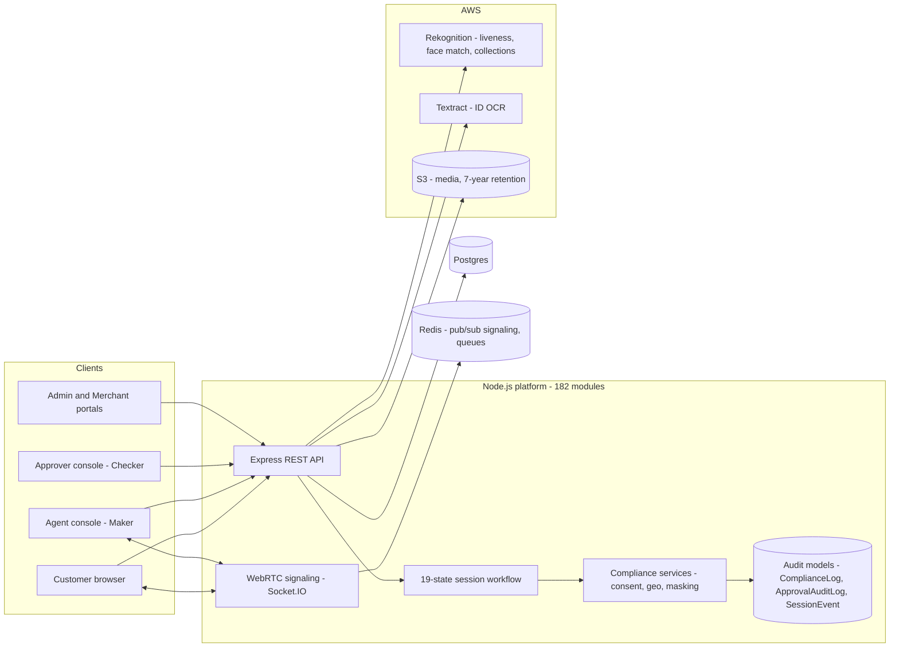
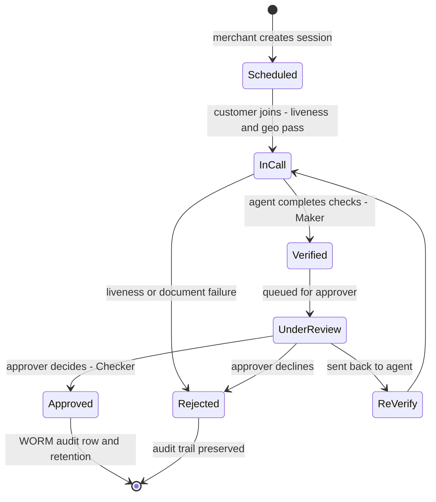

# VCIP Platform — RBI-Compliant Video KYC

> **Production-grade Video Customer Identification (V-CIP) for the Indian banking ecosystem — conceived,
> architected, built, tested, and deployed to AWS by one technical PM in 9 weeks, inside a governed AI
> engineering system.**

**Repo:** [`Identity-Verification-Amazon-Rekognition`](https://github.com/himanisharrma/Identity-Verification-Amazon-Rekognition) (branch `portfolio`) ·
**Scale:** 141K LOC · 3,045 tests · 182 backend modules · 289 frontend files ·
**Cost:** AWS deploy FinOps-optimized to $2–8/month

The repo's own doc pack is the deep dive — this page is the map:
[README](https://github.com/himanisharrma/Identity-Verification-Amazon-Rekognition/blob/portfolio/README.md) ·
By-the-Numbers · Feature Catalog (26 use cases) · Rekognition Pipeline · Journey Flows.

## What it is

A multi-tenant Video-KYC platform: live WebRTC agent video calls, AWS Rekognition face liveness +
face-match + duplicate-identity defense, Textract document OCR with quality gates, geo-fencing + VPN
detection, Aadhaar masking, recorded consent — wrapped in a hard **Maker-Checker** workflow (the agent
who verifies can never be the officer who approves) with audit models as first-class data.

## Architecture at a glance

## The Maker-Checker journey (simplified from the 19-state machine)

## The AI development system (the differentiator)

This was not "AI-assisted coding" — it was a **governed AI SDLC** designed by the PM:

- **1,584-line CLAUDE.md constitution** — anti-hallucination rules (every assumption proven with a file
  path + quoted snippet before coding), TDD-first, layer-first completion, ≤2-file edit limits, mandatory
  RBI compliance gates before any KYC-touching change. *(Capability: CLAUDE.md project memory + context
  management — Anthropic, "Claude Code in Action".)*
- **95% AI-co-authored** — 213 of 223 commits carry Claude co-author trailers, spanning three model
  generations (Opus 4.5 → 4.8). The journey is preserved in git: phase tags, test marathons, CI
  red → green. *(Agentic coding loop; Explore → Plan → Code → Commit.)*
- **Phase-gated E2E testing** mapped to the regulatory journey (`test:phase1` pre-verification →
  `test:phase6` admin oversight) and an 8-phase hardening campaign (~560 tests). *(Test-driven agentic
  development.)*
- **Autonomous browser verification** — Playwright-MCP agents walk the full VCIP journey and document
  it with screenshots. *(MCP servers; agent-driven verification.)*
- **Security remediation in the loop** — full git-history secret scrub (gitleaks + git-filter-repo
  across 255 commits). *(AI-assisted security engineering.)*
- **Sibling artifact:** the [VCIP MCP Server](02-vcip-mcp-server.md) — the agentic control layer built
  on the hackathon edition of this platform.

## PM decisions I'd defend in a room

1. **Build-vs-buy thesis** — banks buy V-CIP from vendors (Signzy, HyperVerge, IDfy); this proves a
   governed-AI in-house build is viable in weeks, with the method documented and repeatable.
2. **Compliance as architecture** — Maker-Checker segregation, WORM audit rows, Aadhaar masking and
   consent are data models and state transitions, not policy documents.
3. **The constitution over vibes** — AI velocity is only safe under enforced rules; the CLAUDE.md is the
   product spec for the AI itself.
4. **FinOps as a feature** — deployed, then cost-optimized 99% to $2–8/month; a PM who watches unit
   economics watches their own infra bill first.
