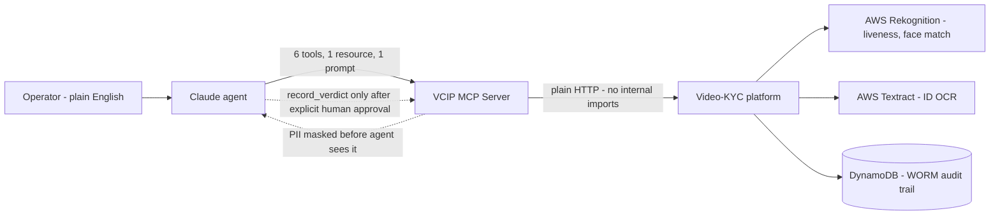

# VCIP MCP Server — the "KYC Orchestrator"

> **An agentic control layer that lets an AI safely run RBI-compliant Video-KYC — while a human
> still decides.** Six tools, one WORM-audit-trail resource, one orchestration prompt; PII masked
> at the tool boundary; the only irreversible write gated three independent ways.

**Repo:** [`video-kyc-hackathon`](https://github.com/himanisharrma/video-kyc-hackathon) (branch `vcip-mcp`) ·
**Artifact:** `mcp-server/index.mjs` (~18KB of focused glue, official MCP SDK, stdio transport) ·
**Full case study:** `VCIP_MCP_PORTFOLIO.md` in the repo

## What it does

A reviewer works a KYC queue in plain English: *"Run a KYC review for session X."* The agent
pulls the liveness result, runs masked ID OCR, compares the face-match score, reads the
append-only audit timeline, writes a one-paragraph risk summary with a recommendation — **then
stops and asks the human verifier** before any verdict is recorded.

## The two design decisions that matter

1. **Human-in-the-loop enforced in architecture, not promised in a pitch.** `record_verdict`
   (permanent WORM audit row) is gated three ways: the orchestration prompt instructs the agent
   to stop and ask; the tool description forbids autonomous calls; the MCP client requires
   operator approval on the call. In a regulated flow, "AI assists, human decides" has to be
   structural.
2. **Compliance at the tool boundary.** The platform endpoint returns raw Aadhaar/PAN/DOB
   (the web UI needs it); the MCP tool **masks client-side before anything reaches the agent**
   — gov-ID numbers to last-4, DOB/address redacted, name + OCR confidence kept. The audit row
   stores field counts, never values.

## Why MCP instead of another REST API (the strategic bet)

A REST API serves developers — every new workflow is an integration sprint. An MCP server
serves an agent, and through it an operator in plain English — **new workflows become prompts,
not sprints.** The same six tools compose into assisted review, fraud triage, re-KYC sweeps,
ops dashboards, or partner KYC-as-a-service with zero new backend work.

## AI capabilities demonstrated (Anthropic-course vocabulary)

- **Custom MCP server** — tools, resources, and prompts built on the official SDK; verified by
  live protocol handshake (6 tools, 1 resource template, 1 prompt registered).
- Lives alongside the repo's full **agentic harness**: 4 custom **subagents**
  (`.claude/agents/`), 6 **slash commands**, 3 **hooks** (incl. a pre-push secret scan), the
  `vcip-kyc` **Agent Skill**, a curated **prompt library** — and the same harness mirrored for
  **OpenAI Codex** (`.codex/`, `AGENTS.md`): the method is vendor-portable.
