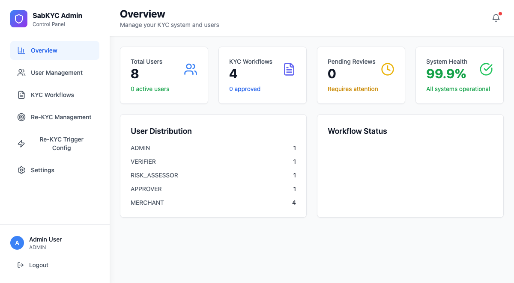
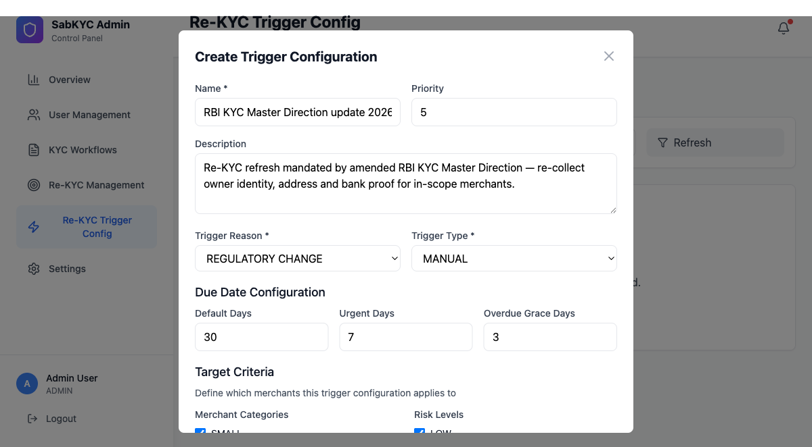
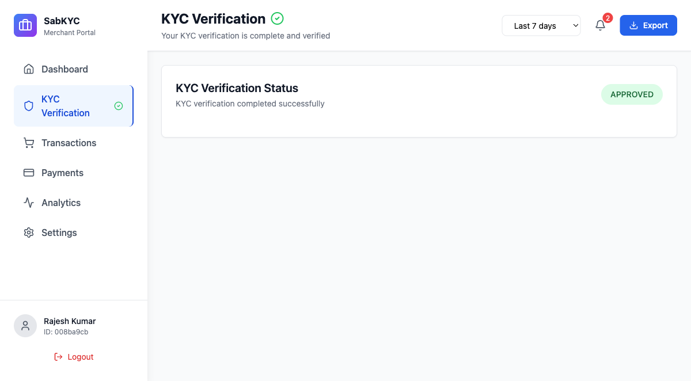
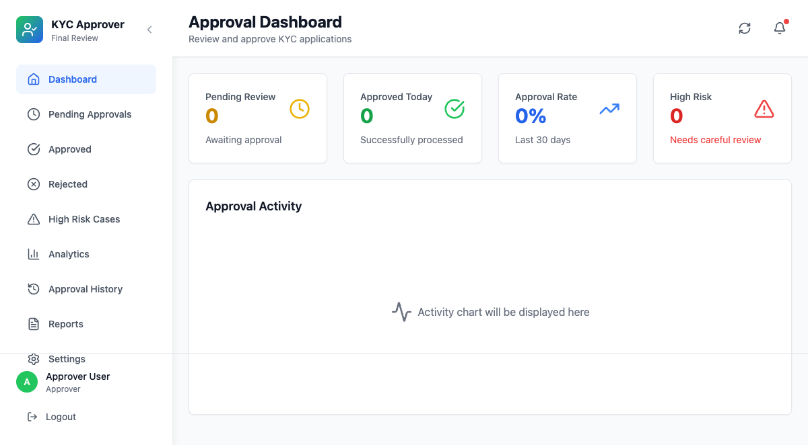

# SabKYC — KYC & Re-KYC Management System

> **A complete multi-role KYC operation in one app:** merchant onboarding → verifier review →
> risk assessment → approver decision, with rule-driven automatic Re-KYC triggering and a
> compliance dashboard.

**Repo:** [`KYC-Re-Verification_SabKYC`](https://github.com/himanisharrma/KYC-Re-Verification_SabKYC) ·
376 files · Node/Express + SQLite + React · repo README includes full architecture diagrams,
DB schema, and API docs

## What it is

A KYC management system for financial institutions: five roles (Merchant, Verifier, Risk
Assessor, Approver, Admin), each with its own dashboard; document verification workflow;
risk-assessment stage; and an **automated Re-KYC engine** — configurable trigger rules compute
due dates and open re-verification cases without manual chasing, with notifications and a
real-time compliance monitoring view.

The product idea: compliance teams don't fail KYC because checks are hard — they fail because
*tracking who needs what, when* is manual. Make the triggering rule-driven and the queues
role-scoped, and the operation runs itself.

## Verified, not just claimed

The release was **E2E-verified via Playwright driven through MCP**: an agent logged in and
walked the login flow, 8 admin routes, the approver console, and 4 merchant routes —
screenshots captured as evidence, zero stale-brand strings rendered. The session also
surfaced and fixed a real auth bug class (stale in-memory seed users vs. the SQLite seeder —
duplicate-seed dedupe committed).

## See it running

A captured live tour of all five roles plus the Re-KYC trigger-configuration flow — the full 12-screenshot narrative is [WALKTHROUGH_CAPTURED.md](https://github.com/himanisharrma/KYC-Re-Verification_SabKYC/blob/main/docs/WALKTHROUGH_CAPTURED.md) in the repo.

| | |
|---|---|
|  |  |
|  |  |

## AI capabilities demonstrated

**MCP-driven autonomous browser verification** (Playwright MCP: multi-role E2E walkthrough
with evidence screenshots) · agentic debugging in the loop (seed/auth discovery) · built in
an AI-co-authored workflow (Claude commit trailers in history).

**Planned next (make-it-real B1):** an in-product Claude API feature — an AI case-summary
endpoint using **tool use + structured JSON output** (risk flags, missing documents,
recommended action) rendered in the verifier dashboard.
